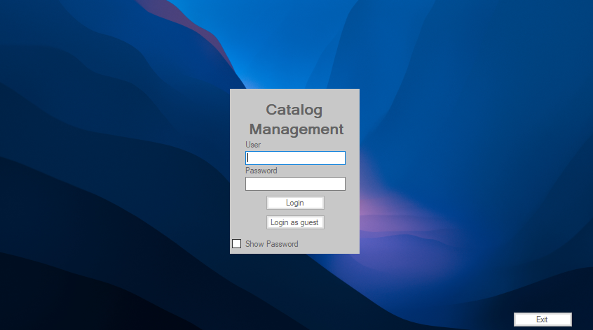

# Catalog Manager

**Catalog Manager** es un proyecto desarrollado en el marco de la materia **Programación 3** de la [Tecnicatura Universitaria en Programación (UTN)](https://www.frgp.utn.edu.ar/carreras/tup_tuss). Desarrollado por Guada Juricich, [Alejandro Morales](https://github.com/AlejandroDanielMorales) y [Alex Welz](https://github.com/alexwelz). Este proyecto consiste un catálogo de artículos. El desarrollo de **Catalog Manager** se llevó a cabo utilizando **Visual Studio Community**, y las tecnologías empleadas fueron **C#** y **Winforms**.

## Funcionalidades

- **Gestión de Artículos**: Permite agregar, modificar, borrar y listar artículos en el catálogo.
- **Módulo de Administrador**: Acceso completo para administrar artículos.
- **Módulo de Invitado**: Acceso limitado para ver el catálogo y los detalles de los artículos sin posibilidad de modificar datos.

  
## ¿Cómo utilizar Catalog Manager?

Para ejecutar este proyecto:

- Cloná el repositorio.
- Abrí el archivo CatalogApp.sln en Visual Studio Community.
- Selecciona la configuración Debug o Release y compila el proyecto.
- Ejecuta el proyecto.
- Inicia sesión como Administrador para acceder a todas las funcionalidades o como Invitado para explorar el catálogo.
  

## Licencia 
Code copyright 2023 Guada Juricich - Alejandro Morales - Alex Welz.
